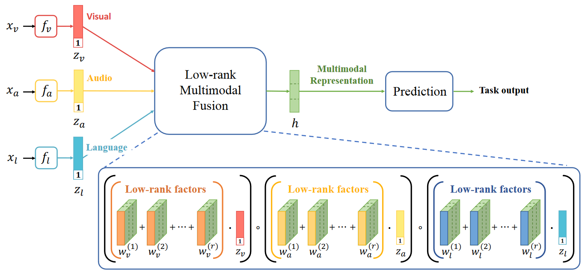

# Low-rank-Multimodal-Fusion
使用Mindspore复现论文Efficient Low-rank Multimodal Fusion with Modality-Specific Factors。
# 1. 论文介绍
## 1.1 论文方法介绍
论文《Efficient Low-rank Multimodal Fusion with Modality-Specific Factors》为了解决基于张量的多模态融合方法计算效率差的问题，提出了一种低秩多模态融合的方法(Low-rank Multimodal Fusion, LMF)的方法。通过将张量和权重并行分解，利用模态特定的低阶因子来执行多模态融合。避免计算高维的张量，降低了内存开销，将指数级的时间复杂度降低到了线性。

LMF(Low-rank Multimodal Fusion)是Zhun Liu，Ying Shen等人在2018年提出的低秩多模态融合方法，文章的主要贡献如下：
1. 提出了一种低秩多模态融合方法LMF，用于多模态融合。
2. 在MOSI、POM、IEMOCAP三个公开数据集上对比了LMF与SOTA模型的性能。
3.  实验验证了LMF方法的计算效率高，并且与以前的基于张量的方法相比，具有更少的参数。


**论文地址**：[Efficient Low-rank Multimodal Fusion with Modality-Specific Factors](https://aclanthology.org/P18-1209.pdf)

**官方repo地址**：https://github.com/Justin1904/Low-rank-Multimodal-Fusion

## 1.2 数据集介绍

论文在MOSI、POM、IEMOCAP三个公开数据集上对LMF方法进行了验证，其中：

1. MOSI数据集对应的任务为多模态的情绪分析，数据集从 YouTube 电影评论中收集 93 个意见视频。 每个视频由多个观点片段组成，每个片段都用 [-3,3] 范围内的情绪进行标注，其中 -3 表示高度负面，3 表示高度正面。
2. POM数据集对应的任务为讲者特质分析，数据集由903个影评视频组成，每个视频都标注了以下16种讲者特征之一：自信、热情、声音悦耳、主导、可信、生动、专业、有趣、保守、信任、放松、外向、彻底、紧张、有说服力和幽默。
3. IEMOCAP对应的任务为情绪识别，数据集是151个录制对话的视频集合，每个会话有2个发言者，整个数据集总共有302个视频。每个片段都标注了9种情绪(愤怒、兴奋、恐惧、悲伤、惊讶、沮丧、高兴、失望和自然)。

## 1.3 Pipeline
本作业将基于论文[官方代码仓库](https://github.com/Justin1904/Low-rank-Multimodal-Fusion)实现，将pytorch版本的网络模型转换成mindspore版本的模型。

LMF方法的模型图如下图所示。首先，LMF通过三个子神经网络$ f_v,f_a,f_l $分别获得视觉、声音、语言三种单模态表征$z_v,z_a,z_l$。然后，LMF通过特定模态因子与表征向量相乘，生成低秩多模态融合表征，并最终通过该表征完成预测任务。



# 2 pytorch实现版本
创建环境：
```shell
conda create -n LMF_python2.7 python=2.7
```
安装依赖包：
```shell
# packages in environment at /opt/conda/envs/LMF_python2.7:
#
# Name                    Version                   
_libgcc_mutex             0.1                       
_openmp_mutex             5.1                     
blas                      1.0                        
ca-certificates           2023.05.30           
certifi                   2020.6.20          
cffi                      1.14.0          
cudatoolkit               9.0                
cudnn                     7.6.5                 
intel-openmp              2022.1.0          
libffi                    3.3                 
libgcc-ng                 11.2.0               
libgfortran-ng            7.5.0               
libgfortran4              7.5.0               
libgomp                   11.2.0               
libstdcxx-ng              11.2.0               
mkl                       2018.0.3                  
mkl_fft                   1.0.6            
mkl_random                1.0.1            
nccl                      1.3.5                 
ncurses                   6.4                  
ninja                     1.10.2              
ninja-base                1.10.2           
numpy                     1.15.1           
numpy-base                1.15.1          
pip                       19.3.1                   
pycparser                 2.20                      
python                    2.7.18             
pytorch                   0.4.1            
readline                  8.2                 
scikit-learn              0.20.0           
scipy                     1.1.0            
setuptools                44.0.0                   
sqlite                    3.41.2               
tbb                       2021.8.0             
tbb4py                    2019.8           
tk                        8.6.12              
wheel                     0.37.1             
zlib                      1.2.13              

```
下载[数据集](https://drive.google.com/open?id=1CixSaw3dpHESNG0CaCJV6KutdlANP_cr)将其放在`./data`文件夹下

## 2.2 运行代码
运行程序`train_XXX.py`进行模型训练，程序中包含的部分命令行参数如下：

|        命令行参数        | 作用                                                         |
| :----------------------: | :----------------------------------------------------------- |
|        `--run_id`        | 用户指定的唯一 ID，以确保保存的结果/模型不会相互覆盖。       |
|        `--epochs`        | 训练中的最大轮数。                                           |
|       `--patience`       | 如果模型性能在连续 `--patience` 次验证评估中没有提高，训练将提前停止。 |
|      `--output_dim`      | 模型的输出维度。                                             |
|      `--signiture`       | 添加到输出文件名的可选字符串。                               |
|      `--data_path`       | 数据目录的路径。                                             |
|      `--model_path`      | 保存模型的目录路径。                                         |
|     `--output_path`      | 保存模型输出结果                                             |
|       `--max_len`        | 训练数据序列的最大长度。 更长/更短的序列将被截断/填充。      |
|       `--emotion`        | （IEMOCAP 独有）指定你想要训练模型预测的情绪类别。 可以是“happy”、“sad”、“angry”、“neutral”。 |
|     `--audio_hidden`     | 音频隐层维度                                                 |
|     `--video_hidden`     | 视频隐层维度                                                 |
|     `--text_hidden`      | 文本隐层维度                                                 |
|    `--audio_dropout`     | 音频随机失活率                                               |
|    `--video_dropout`     | 视频随机失活率                                               |
|     `--text_dropout`     | 文本随机失活率                                               |
| `--factor_learning_rate` | 特定模态因子的学习率                                         |
|    `--learning_rate`     | 其他参数的学习率                                             |
|         `--rank`         | 多模态融合表征的秩                                           |
|      `--batch_size`      | 批处理大小                                                   |
|     `--weight_decay`     | 权重衰减率                                                   |

```shell
python train_pom_mindspore.py --signiture test-pom-Passion --audio_hidden 16 --video_hidden 16 --text_hidden 64 --audio_dropout 0.3 --video_dropout 0.5 --text_dropout 0.2 --factor_learning_rate 0.0005 --learning_rate 0.001 --rank 4 --batch_size 16 --weight_decay 0
```
模型取得最优结果的部分超参可以参考hyperparams.txt

# 3 mindspore实现版本
代码仓库：https://github.com/Powerdiao/wy_mindspore-master
### 3.1 mindspore框架介绍
MindSpore是华为推出的一款人工智能计算框架，主要用于开发AI应用和模型。下面是 MindSpore 的一些特点和功能：

- 自动并行：MindSpore 使用了自动并行算法，能够自动优化计算图的并行执行，提高训练和推理的效率。

- 灵活的计算图模型：MindSpore 支持静态和动态计算图，开发者可以根据需求选择适合的模型。动态图模型能够提供更高的灵活性和可读性，适用于实验和原型开发。静态图模型则可以提供更好的性能和部署优化。

- 跨平台支持：MindSpore 能够在各种硬件平台上运行，包括华为自家的昇腾AI芯片、GPU、CPU 等。这使得开发者可以根据不同的需求选择最适合的硬件平台。

- 安全和隐私保护：MindSpore 引入了差分隐私技术，能够在不泄露用户数据的前提下对模型进行训练。此外，MindSpore 还提供了对抗样本训练和推理防护等功能，以提高模型的安全性和鲁棒性。

- AI 栈支持：MindSpore 提供了丰富的 AI 栈，包括数据处理、特征工程、模型定义、训练和推理等功能。这使得开发者能够在一个框架内完成整个 AI 开发流程，减少了集成和部署的复杂性。

- 社区支持和开放性：MindSpore 是一个开源框架，拥有活跃的社区支持。开发者可以通过社区参与贡献代码、报告问题和分享经验。

### 3.2 环境准备
操作系统 ： Ubuntu 18.04.5

创建虚拟环境并且切换到环境：
```shell
conda create -n LMF_python2.7 python=2.7
conda activate LMF_python2.7
```
克隆已经实现好的mindspore版本LMF代码：
```shell
https://github.com/Powerdiao/wy_mindspore-master.git
```
下载依赖包：
```angular2html
cd MAMO_mindspore
pip install mindspore==2.0.0a0
```

## 3.3 模型迁移
官方给出了相关的文档说明，以便将Pytorch的API替换成mindspore的API。
另外mindspore还提供了MindConverter工具，方便从pytorch迁移模型。

下面是此模型中被替换的API/class:

 

| pytorch API/class             | mindspore API/class                        | 说明                                                         | 两者差异                                                     |
| ----------------------------- | ------------------------------------------ | ------------------------------------------------------------ | ------------------------------------------------------------ |
| torch.tensor                  | mindspore.Tensor                           | 张量，即存储多维数组（n-dimensional array）的数据结构。      |                                                              |
| torch.cat                     | mindspore.ops.Concat                       |                                                              | PyTorch: 输入tensor的数据类型不同时，低精度tensor会自动转成高精度tensor。MindSpore: 当前要求输入tensor的数据类型保持一致，若不一致时可通过ops.Cast把低精度tensor转成高精度类型再调用Concat算子。 |
| torch.ones                    | mindspore.ops.Ones                         | 创建一个值全为1的Tensor                                      |                                                              |
| torch.matmul                  | mindspore.nn.MatMul                        | 计算两个数组的乘积                                           |                                                              |
| torch.nn.Module               | mindspore.nn.Cell                          | MindSpore中神经网络的基本构成单元。模型或神经网络层应当继承该基类。 |                                                              |
| torch.nn.Dropout              | mindspore.nn.Dropout                       | 随机丢弃层。一种正则化手段                                   |                                                              |
| torch.nn.BatchNorm1d          | mindspore.nn.BatchNorm1d                   |                                                              | PyTorch：用于running_mean和running_var计算的momentum参数的默认值为0.1。MindSpore：momentum参数的默认值为0.9，与Pytorch的momentum关系为1-momentum，即当Pytorch的momentum值为0.2时，MindSpore的momemtum应为0.8。其中，beta、gamma、moving_mean和moving_variance参数分别对应Pytorch的bias、weight、running_mean和running_var参数。 |
| torch.nn.Linear               | mindspore.nn.Dense                         |                                                              | Pytorch：对传入数据应用线性变换，默认权重矩阵和偏移矩阵都由均匀分布初始化。MindSpore：对传入数据应用线性变换，在输出数据之前可以选择应用激活函数`activation`，默认权重矩阵由标准正态分布初始化，偏移矩阵初始化为0。 |
| torch.nn.LSTM                 | mindspore.nn.LSTM                          | 长短期记忆（LSTM）网络，根据输出序列和给定的初始状态计算输出序列和最终状态。 |                                                              |
| torch.nn.functional.relu      | mindspore.ops.ReLU                         | 线性修正单元激活函数（Rectified Linear Unit）。              |                                                              |
| torch.nn.functional.softmax   | mindspore.ops.Softmax                      |                                                              | PyTorch：支持使用`dim`参数和`input`输入实现函数，将指定维度元素缩放到[0, 1]之间并且总和为1。MindSpore：支持使用`axis`属性初始化Softmax，将指定维度元素缩放到[0, 1]之间并且总和为1。 |
| torch.autograd.variable       | mindspore.Parameter                        | Parameter 是 Tensor 的子类，当它们被绑定为Cell的属性时，会自动添加到其参数列表中，并且可以通过Cell的某些方法获取 |                                                              |
| torch.nn.Parameter            | mindspore.Parameter                        |                                                              |                                                              |
| torch.nn.init.xavier_uniform_ | mindspore.common.initializer.XavierUniform | 生成一个服从Xarvier均匀分布U(-boundary, boundary)的随机数组用于初始化Tensor |                                                              |
| torch.optim.Adam              | mindspore.nn.Adam                          |                                                              |                                                              |


# 4 运行结果
评估过程中主要执行的是多分类任务和回归任务，其中，多分类任务对应于所有数据集，回归任务对应于MOSI和POM数据集。对于多分类任务，评估指标为F1分数和准确度Acc；对于回归任务，评估指标为平均绝对误差MAE和Pearson相关性Corr。在各个数据集上的复现结果如下表所示。其中，模型在POM数据集上的结果为16种讲者特征的均值。

**MOSI**

| MAE       | Corr  | Acc2  | F1   | Acc-7 |      |
| --------- | ----- | ----- | ---- | ----- | ---- |
| 论文结果  | 0.912 | 0.668 | 76.4 | 75.7  | 32.8 |
| pyTorch   | 1.069 | 0.560 | 72.1 | 72.1  | 31.6 |
| Mindspore | 1.080 | 0.565 | 72.1 | 72.1  | 31.2 |

**POM**

| MAE       | Corr  | Acc   |      |
| --------- | ----- | ----- | ---- |
| 论文结果  | 0.796 | 0.396 | 42.8 |
| pyTorch   | 0.863 | 0.248 | 34.5 |
| Mindspore | 0.822 | 0.320 | 39.2 |


**IEMOCAP**

|           | F1-Happy | F1-Sad | F1-Angry | F1-Neutral |
| :-------: | :------: | :----: | :------: | :--------: |
| 论文结果  |   85.8   |  85.9  |   89.0   |    71.7    |
|  pyTorch  |   84.6   |  78.4  |   85.2   |    65.7    |
| Mindspore |   83.9   |  84.5  |   87.2   |    68.8    |


